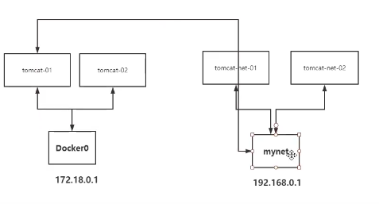
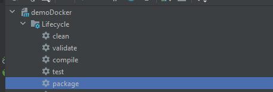

# DockerLearning

This is a learning notes.

learning Docker from 狂神说 in https://www.bilibili.com/video/BV1og4y1q7M4?p=1&vd_source=a788bdd4d7cdd9dfe02852346d523cb9

Total video length : 8h 11m 41s

21.06.2022 - start

22.06.2022  - complete


Environment: Linux

# Important Step for Docker:

DockerFile : Generate image from layer by layer of software.
DockerImages ：A product.
DockerContainer : Run an Image to privide services.


# Commands

Remember : systemctl start docker


## Help Command

```
docker version
docker info
docker stats                        //status
docker networks ls
```


```
docker [command] --help
```


## Image Command

```docke
docker [OPTIONS] images             //show downloaded images
       -a                           //show all
       -q                           //only show id
       
docker search imagename             //search image from docker hub. eg. docker search mysql
docker pull imagename[:version]     //download from docker hub. eg.docker pull mysql:5.7. version refer to docker hub website
docker rmi [OPTIONS] imageid        //remove image, eg. docker rmi -f $(docker -aq images) <-- delete all  
           -f                       //force
docker history imageId              //see how the image generated.   
docker tag SOURCE_IMAGE[:TAG] TARGET_IMAGE[:TAG]    //Create a tag TARGET_IMAGE that refers to SOURCE_IMAGE
```


##  Container Command

```
docker run [OPTION] image command   //run image in a container
            --name=?                //container name
            -d                      //run in background
            -it                     //iterative + tty
            -p x:y                  //use localhost port x to visit container port y (expose port y)
            -P                      //publish all exposed ports to random ports
            --rm                    //when exit: delete container
            -e                      //[e]nvironment variable eg. -e ES_JAVA_OPTS="-Xms64m -Xmx512m" (elastic search) 
            -v a:b                  //mount localDir:containerDir
            --volumes-from ContainerIdOrName //share volume from ...
    while using:  exit
                  ctrl + p + q      //run in background

docker ps [OPTIONS]                 //show currently 'up' container
          -a                        //all including 'exit' container
          -n=?                      //last n numbers
          -q                        //quiet - show only container id
          -l                        //last run container
```


```
docker start containerId
docker restart containerId
docker stop containerId
docker kill containerId

docker commit [OPTIONS] containerId imageName:version   //commit and create your image in your images
              -m="?"                                    //description
              -a="?"                                    //author             
```


## Volumes commands

```
docker volume ls
docker volume inspect
```


## Other useful commands

```
docker logs [OPTIONS] containerId   //show logs
            -ft                     //Follow logs output, Timestamp
            --tail number           //show only last [number]

docker top containerId              //show detail of process
```


```
docker inspect containerId          //show container's detail
docker exec -it containerId  command//enter container (start from zero)
docker attach containerId           //enter container
docker cp containerId:path destPath //copy file from container to host
```


# Visualize (rarely use)

- portainer : Docker's visualize management tool

  

```
docker run -d -p 8088:9000 --restart=always -v /var/run/docker.sock:/var/run/docker.sock --privileged=true portainer/portainer
```


# About Image

- What : light-weight software package, which include the software itself and environments and development software used.
- How to get : Hub, copied from friends, selfmake 
- using UnionFs --> save file layer by layer --> avoid duplicate layer


# About Volume (Directories synchronize)


**Everything change in container directory reflect in local directory, vice versa. **

i) prevent the data lost when removing a container.
ii) prevent the needs to exec container to change data. 


- Method 1: docker run ...

  ```
  -v containerDir           #anonymous mount
  -v name:containerDir      #named mount
  -v localDir:containerDir  #path mount
  
  Q: -v juming-nginx:/etc/nginx:ro nginx <-- what is :ro? (eg rw...)
  read only. This dir cannot be modified using container, however it is allowed when using localDir.
  ```

- Method 2: DockerFile

  ```
  ###filename: dockerfile1
  
  FROM centos 
  
  VOLUME ["volume01","volume02"] # <--- anonymous mount
  
  CMD echo "----end----"
  CMD /bin/bash
  ```

  to build a image : docker build -f /..../dockerfile1 -t imageName:tag . ***there is a '.'at last**
  Tips: to share these volume
      docker run -it --name name2 **--volumes-from name1** imageName:tag

     * after remove name1, the shared volume still shared by name2. 


# About DockerFile

- What is DockerFile ? It is a shellscript, to generate an image. 

- create mounts everytime when building this dockerfile generated image.

  ```shell
  #Commands: ****MUST BE CAPITAL LETTER,
  #<-- is comment
  FROM ______                   # base image, DockerHub 99% FROM scratch
  MAINTAINER                    # who wrote it? Name + email
  ADD                           # Add , if add tar.gz -> untar
  WORKDIR                       # image working directory
  VOLUME                        # Mount directory
  EXPOSE                        # Expose which port
  CMD                           # commands. refer below: difference between CMD and Entrypoint
  ENTRYPOINT                    # commands, ditto.
  ONBUILD                       # while building extended dockerfile, use this command
  COPY                          # copy our file to image
  ENV                           # set environment variable
  RUN                           # build image commands
  ```

  *IF named: Dockerfile, there is no need to use -f to mention it. build command will search for it automatically.


  

  >My image example 1:

  ```
  FROM centos:7
  MAINTAINER jacksoon<abcdefg@gmail.com>
  
  ENV MYPATH /usr/local
  WORKDIR $MYPATH
  
  RUN yum -y install vim
  RUN yum -y install net-tools
  
  EXPOSE 80
  
  CMD echo $MYPATH
  CMD echo "----end----"
  CMD /bin/bash
  ```

  >My image example 2: (Tomcat + JDK)

  ```
  FROM centos:7
  MAINTEINER jacksoon<abcdefg@gmail.com>
  
  COPY readme.txt /usr/local/readme.txt
  ADD jdk-8u331-linux-x64.tar.gz /usr/local/
  ADD apache-tomcat-9.0.63.tar.gz /usr/local/
  
  RUN yum -y install vim
  
  ENV MYPATH /usr/local
  WORKDIR $MYPATH
  
  ENV JAVA_HOME /usr/local/jdk1.8.0_331
  ENV CLASSPATH $JAVA_HOME/lib/dt.jar:$JAVA_HOME/lib/tools.jar
  ENV CATALINA_HOME /usr/local/apache-tomcat-9.0.63
  ENV CATALINA_BASE /usr/local/apache-tomcat-9.0.63
  ENV PATH $PATH;$JAVA_HOME/bin;$CATALINA_HOME/lib;$CATALINA_HOME/bin
  
  EXPOSE 8080
  
  CMD /usr/local/apache-tomcat-9.0.63/bin/startup.sh && tail -F /usr/local/apache-tomcat-9.0.63/logs/catalina.out
  
  ```

  example build:
    docker run -d -p 9090:8080 -v /home/kuangshen/build/tomcat/test:/usr/local/apache-tomcat-9.0.63/webapps/test 
    -v /home/kuangshen/build/tomcat/tomcatlogs/:/usr/local/apache-tomcat-9.0.63/logs mytomcatjdk

  

  >Different between CMD and ENTRYPOINT
  >
  >CMD ["ls","-a"] vs ENTRYPOINT ["ls","-a"]
  >
  >docker run imageWithCMD -l --> error
  >
  >docker run imageWithENTRYPOINT -l ---> became ls -al

  

# Push to DockerHub

- register in hub.docker.com
- login in docker using in terminal

```dockerfile
docker login [OPTIONS] [SERVER] //no server = default daemon
              -p passwd       //password [dont use this option, to use encryt in next line]
              -u username     //username 
```

- push to dockerhub

```
docker push name:tag
```


# Docker Network


ip addr --> found docker0


>check containers's ip:
>
>docker exec -it tomcat01 ip addr 
>
>*need to apt update && apt install -y iproute2 (inside container) <--- incase:
>
>

>noticed 20 and 21!
>
>

> main terminal ping 172.17.0.2 --> ok
>
> 

> main terminal ip addr became:, noticed 21 and 20! Tally with above mentioned --> veth-pair
>
> 


**veth-pair as a bridge to connect and transfer data**

- Openstac, Docker use evth-pair. 
- different container is **able** to ping pong each other.
  

## --link (NOT RECOMMENDED)


- we hope to ping each other by Name instead of Ip:

- eg. docker run -d -P --name tomcat01 --link tomcat02 tomcat

- tomcat01 record the tomcat02 ip into its' /etc/hosts

- **!!! the tomcat02 side cannot ping pong it since it did NOT record ip into its' hosts file.**

  

**.... As Docker0 Failed to do so... --> customize own network**


## Customize Network


```dockerfile
docker network create --driver bridge --subnet 192.168.150.0/24 --gateway 192.168.150.1 mynet
```


```dockerfile
docker run -d --name tomcat01 --net mynet tomcat
docker run -d --name tomcat02 --net mynet tomcat
docker exec -it tomcat01 ping tomcat02 #OK!!!
docker exec -it tomcat02 ping tomcat01 #OK!!!
```


## Connection between Container & Network




```dockerfile
docker network connect [OPTIONS] NETWORK CONTAINER
```

--> docker network inspect mynet --> container is shown in mynet Containers;


# Exercise

## Exercise - Redis Cluster

3 master 3 slave model

```dockerfile
#create network
docker network create redis --subnet 172.38.0.0/16 
```

```shell
#shell to paste and make 6 settings for mentioned model
for port in $(seq 1 6); \
do \
mkdir -p /mydata/redis/node-${port}/conf
touch /mydata/redis/node-${port}/conf/redis.conf
cat << EOF >/mydata/redis/node-${port}/conf/redis.conf
port 6379
bind 0.0.0.0
cluster-enabled yes
cluster-config-file nodes.conf
cluster-node-timeout 5000
cluster-announce-ip 172.38.0.1${port}
cluster-announce-port 6379
cluster-announce-bus-port 16379
appendonly yes
EOF
done

```

```shell
#shell to paste and open 6 redis containers

for port in $(seq 1 6);
do \
docker run -p 637${port}:6379 -p 1637${port}:16379 --name redis-${port} \
-v /mydata/redis/node-${port}/data:/date \
-v /mydata/redis/node-${port}/conf/redis.conf:/etc/redis/redis.conf \
-d --net redis --ip 172.38.0.1${port} redis:5.0.9-alpine3.11 redis-server /etc/redis/redis.conf
done

#####################################################
docker run -p 6371:6379 -p 16371:16379 --name redis-1 \
-v /mydata/redis/node-1/data:/date \
-v /mydata/redis/node-1/conf/redis.conf:/etc/redis/redis.conf \
-d --net redis --ip 172.38.0.11 redis:5.0.9-alpine3.11 redis-server /etc/redis/redis.conf
```

```dockerfile
docker exec -it redis-1 /bin/sh #no /bin/bash

redis-cli --cluster create 172.38.0.11:6379 172.38.0.12:6379 172.38.0.13:6379 172.38.0.14:6379 172.38.0.15:6379 172.38.0.16:6379 --cluster-replicas 1
```

DONE !

test:

```shell
redis-cli -c 		#-c stands for cluster
..
: cluster info
: cluster nodes
```


## Exercise - SpringBoot Project Image


Package



Saw my jar


create Dockerfile & copy out jar from target


```
FROM java:8

COPY *.jar /app.jar

CMD ["--server.port=8080"]

EXPOSE 8080

ENTRYPOINT ["java","-jar","/app.jar"]
```

..

build

..

run

..

curl localhost:port/test/hello


succeed!

# Shortcut for future

```dockerfile
docker run -d --name elasticsearch -p 9200:9200 -p 9300:9300 -e "discovery.type=single-node" -e ES_JAVA_OPTS="-Xms64m -Xmx512m" elasticsearch:7.6.2

docker run -d --name mysql01 -p 3310:3306 -v /home/mysql/conf:/etc/mysql/conf.d -v /home/mysql/data:/var/lib/mysql -e MY_SQL_ROOT_PASSWORD=123456 mysql
```


# Advance Knowledge to Learn (In future)

IF: 100 images? HOW?

## 1. Docker Compose


##  2. Docker Swarm


## 3. CI/CD -- Jenkins

